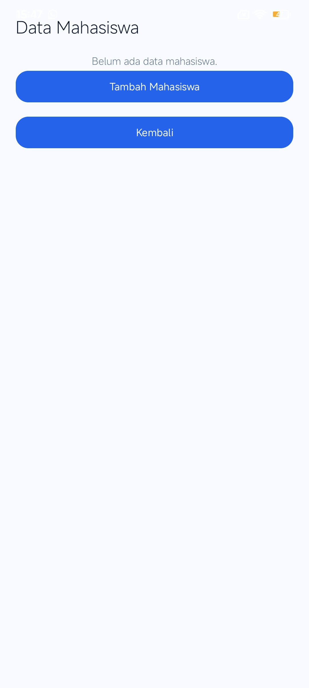
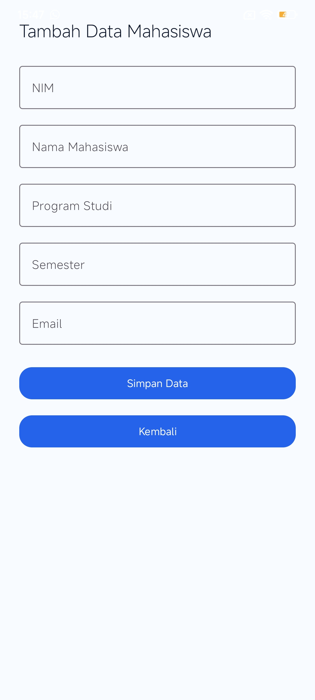
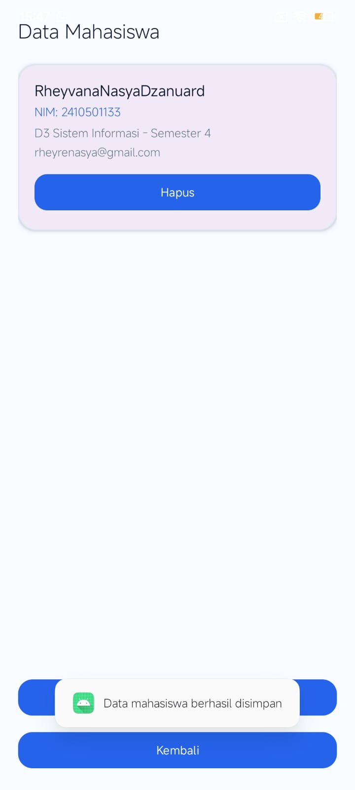

# AkademikApp

Aplikasi akademik Android sederhana yang menampilkan menu mahasiswa dengan RecyclerView dan manajemen data menggunakan SQLite.

## Fitur
- RecyclerView mode List
- RecyclerView mode Grid
- RecyclerView mode Card
- CRUD Data Mahasiswa dengan SQLite
- Dashboard Admin

## Teknologi
- Kotlin
- Android Studio
- RecyclerView
- Material Design
- ViewBinding
- SQLite (Database Lokal)

---

## Pertemuan 7 — RecyclerView Mode List

### Screenshots
### Halaman Utama

### Mode List

---

## Pertemuan 9 — RecyclerView Mode Grid dan Card

### Screenshots
### Mode Grid

### Mode Card

---

## Pertemuan 10 & 11 — Koneksi Database SQLite

### Screenshots
### Dashboard Admin

### Data Mahasiswa

### Tambah Mahasiswa
