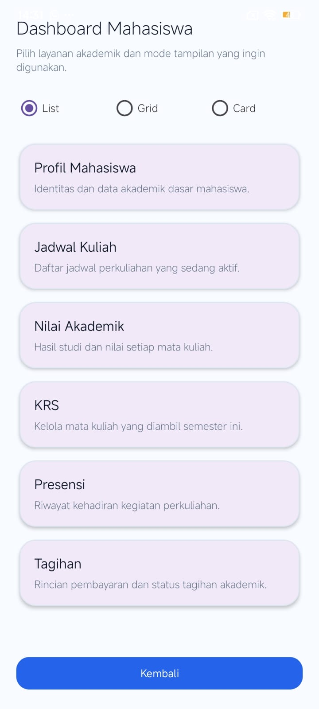
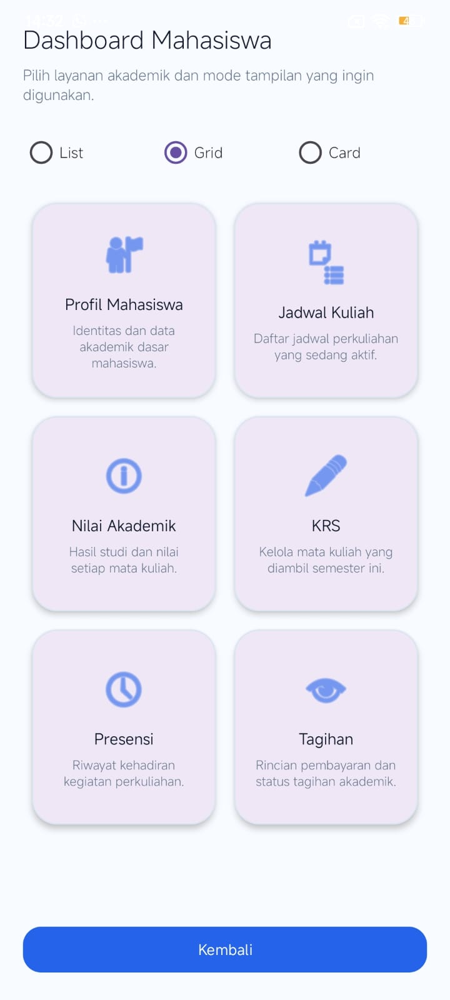
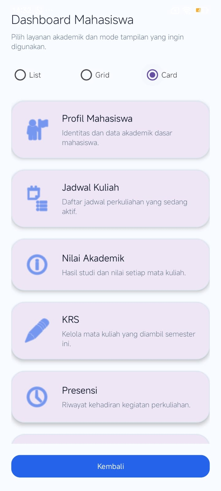

# AkademikApp

Aplikasi akademik Android sederhana yang menampilkan menu mahasiswa dengan RecyclerView.

## Fitur
- RecyclerView mode List
- RecyclerView mode Grid
- RecyclerView mode Card

## Teknologi
- Kotlin
- Android Studio
- RecyclerView
- Material Design
- ViewBinding

## Pertemuan
- Pertemuan 7 : RecyclerView Mode List
- Pertemuan 9 : RecyclerView Mode Grid dan Card

## Screenshots

### Halaman Utama

### Mode List

### Mode Grid

### Mode Card
